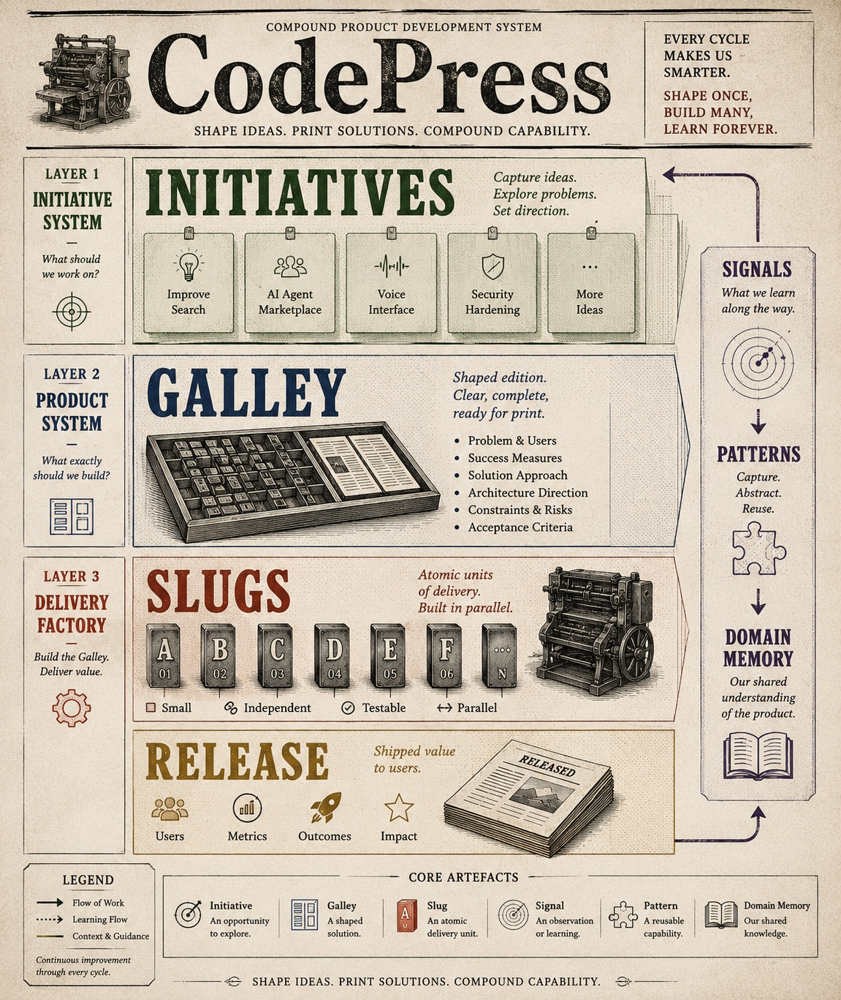

<link rel="stylesheet" href="/codepress/assets/css/custom.css">

  <a href="index.html">Home</a>
  <a href="quick-start.html">Quick Start</a>
  <a href="structure.html">View Structure</a>
  <a href="https://github.com/zylum/codepress">GitHub</a>

# Overview

The CodePress compound loop — how ideas become shaped solutions, get built, and compound into reusable knowledge.

  

The diagram illustrates the full lifecycle:

1. **Initiatives** — raw ideas and opportunities
2. **Galleys** — shaped solutions ready for delivery
3. **Slugs** — atomic delivery units, built in parallel
4. **Releases** — delivered value
5. **Signals** — observations captured during delivery
6. **Patterns** — validated, reusable lessons
7. **Knowledge** — shared understanding that improves future work

Each cycle feeds the next. Every delivery leaves the system smarter.
